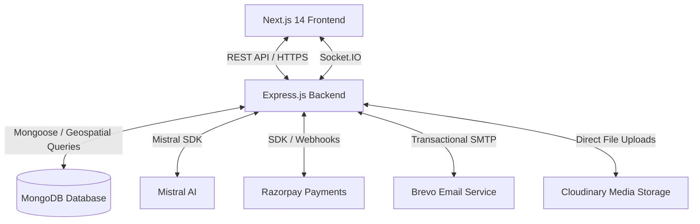

# AI TripConnect

AI TripConnect is a comprehensive, full-featured AI-powered trip-planning and local service-marketplace platform. It bridges the gap between:
- **Travelers** looking to plan their trips efficiently, manage expenses, and hire verified local service providers (guides, drivers, homestay hosts, photographers).
- **Service Providers** wishing to advertise their services, manage bookings, and get paid securely.
- **AI Travel Assistant** providing smart semantic searches, RAG chatbot assistance, review summarization, and customized day-by-day itineraries.

The project is structured as a monorepo containing a **React/Next.js frontend** and an **Express/Node.js backend**.

---

## 🏗️ Architecture & Technology Stack

The platform is designed with a decoupled architecture where the frontend client communicates with the backend REST API and Socket.IO servers.



### 💻 Frontend ([frontend/](file:///c:/react-3/Travel%20App/frontend))
- **Framework**: Next.js 14 (App Router) for Server-Side Rendering (SSR) and client pages.
- **Styling**: Tailwind CSS for responsive, modern UI design.
- **State Management**: Zustand for auth persistence, notifications, and client state.
- **Real-Time Client**: Socket.IO Client for instant booking chat messages.
- **Charts & Visualization**: Recharts for trip expense breakdowns and admin analytics.
- **Form Management**: React Hook Form with Zod schema validation.

### ⚙️ Backend ([backend/](file:///c:/react-3/Travel%20App/backend))
- **Runtime**: Node.js with Express.js REST APIs.
- **Database**: MongoDB using Mongoose ODM with geospatial (`2dsphere`) indexes.
- **Authentication**: JWT (Access & Rotate-on-use Refresh tokens) and Passport.js Google OAuth 2.0.
- **Real-Time Communication**: Socket.IO server with authenticated WebSocket handshakes and message access control.
- **Testing Suite**: Jest, Supertest for integration testing, and Autocannon for load/stress testing.

---

## 🤖 AI Features (Powered by Mistral AI)

AI TripConnect leverages the `mistral-large-latest` LLM to provide five distinct intelligent features:

1. **AI Trip Draft** (`POST /trips/ai-draft`): Generates a structured trip title, description, and suggested budget from raw user notes.
2. **AI Itinerary Generation** (`POST /itineraries/generate`): Drafts custom daily breakdowns matching trip parameters and dynamically links real, verified providers from the database near the destination.
3. **AI Smart Search** (`GET /providers/search/smart`): Performs semantic user queries (e.g. *"knowledgeable local history guide in Jaipur"*) to match profiles beyond keyword lookups.
4. **AI Review Summary** (`GET /reviews/provider/:id/summary`): Condenses all traveler reviews for a specific provider into a clear, concise bulleted summary.
5. **AI Travel Assistant (RAG)** (`POST /assistant/ask`): An interactive chatbot utilizing Retrieval-Augmented Generation to look up bookings, review profiles, or answer travel questions safely.

---

## 📂 Project Directory Structure

```
Travel App/
├── backend/                       # Express Node.js Backend API
│   ├── __tests__/                 # Unit, integration, and load test suites
│   ├── src/                       # Application source code
│   │   ├── config/                # Environment variables, Passport, DB configuration
│   │   ├── controllers/           # Route handler controllers
│   │   ├── models/                # Mongoose Database schemas
│   │   ├── routes/                # Express API endpoint definitions
│   │   └── utils/                 # Token generation, sanitization, AI/API client wrappers
│   └── package.json
│
├── frontend/                      # Next.js 14 Web Application
│   ├── app/                       # Page routing (App Router layout)
│   ├── components/                # Modular UI components (Auth, Layout, Shared)
│   ├── lib/                       # API clients, socket connection, utilities
│   ├── store/                     # Zustand state definitions
│   └── package.json
│
└── README.md                      # This global project README
```

---

## 🚀 Getting Started

### Prerequisites
Make sure you have [Node.js](https://nodejs.org/) (v18+) and [MongoDB](https://www.mongodb.com/) installed and running locally.

---

### Backend Setup

1. Open your terminal and navigate to the backend directory:
   ```bash
   cd backend
   ```
2. Copy the sample environment file and configure your credentials:
   ```bash
   cp .env.example .env
   ```
   *Required variables include: `PORT` (default 5000), `MONGO_URI`, `ACCESS_TOKEN_SECRET`, `REFRESH_TOKEN_SECRET`, `MISTRAL_API_KEY`, `RAZORPAY_KEY_ID`, `RAZORPAY_KEY_SECRET`, `BREVO_API_KEY`, `CLOUDINARY_CLOUD_NAME`.*
3. Install dependencies:
   ```bash
   npm install
   ```
4. Start the server in development mode:
   ```bash
   npm run dev
   ```
   *The server will start running on [http://localhost:5000](http://localhost:5000).*

---

### Frontend Setup

1. Open a new terminal and navigate to the frontend directory:
   ```bash
   cd frontend
   ```
2. Copy the sample environment file:
   ```bash
   cp .env.local.example .env.local
   ```
   *Required variables: `NEXT_PUBLIC_API_URL` (usually `http://localhost:5000/api`) and `NEXT_PUBLIC_RAZORPAY_KEY_ID`.*
3. Install dependencies:
   ```bash
   npm install
   ```
4. Start the Next.js development server:
   ```bash
   npm run dev
   ```
   *The client will start running on [http://localhost:3000](http://localhost:3000).*

---

## 🔒 Security & Performance Features

- **NoSQL Injection & Parameter Pollution Prevention**: Integrated `express-mongo-sanitize` and `hpp` to secure DB query inputs.
- **XSS Mitigation**: Incoming messages are sanitized via `sanitize-html` to filter out malicious scripts.
- **Brute-Force & Rate Limiting**: Limit-throttling on sensitive routes like auth registration and login endpoints, plus 5-failed-attempts account lockout.
- **Geospatial Indexes**: High-performance querying of nearby providers using native MongoDB `2dsphere` indexes.
