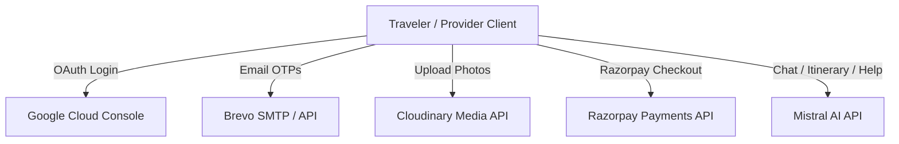

# TripConnect Backend

TripConnect is a robust, full-featured backend for a trip-planning and local service-marketplace platform. It provides traveler/provider authentication, a service provider marketplace with geospatial search, a secure booking system integrated with Razorpay payments, real-time chat powered by Socket.IO, an AI itinerary generator and RAG assistant using Mistral AI, and an administrative analytics layer.

---

## 1. Implemented Features

### 1.1 Authentication & Session Security
- **Unified Auth Paths**: Single token issuance pipeline ([src/utils/token.util.js](file:///c:/react-3/Travel App/backend/src/utils/token.util.js)) that handles both email/password credentials and Google OAuth.
- **Google OAuth 2.0 Integration**: Social login built using Passport.js ([src/config/passport.js](file:///c:/react-3/Travel App/backend/src/config/passport.js)), aligning Google profile data with the user schema and issuing unified JWT access/refresh token pairs.
- **OTP-Based Email Verification**: During email signup, users are locked (`isEmailVerified: false`) until they submit a matching, unexpired 6-digit One-Time Password (OTP) sent to their email.
- **Forgot & Reset Password Flow**: Secure recovery pipeline using OTP codes. Resetting password clears all active sessions from the database by invalidating the stored refresh token hashes.
- **JWT Rotation & HTTPOnly Cookies**:
  - `accessToken` is returned in the response payload (expiry `15m`).
  - `refreshToken` is stored in a secure, `httpOnly`, `sameSite: strict` cookie (expiry `7d`).
  - Refresh tokens are rotation-based: reusing a rotated token invalidates the entire session to prevent token-theft.
  - The server only stores the bcrypt hash of the refresh token in the database for maximum security.
- **Brute-Force Account Protection**: Per-account lockout after 5 consecutive failed login attempts (locked for 15 minutes) combined with IP-based rate limiting on auth routes.

### 1.2 Provider & Service Marketplace
- **Registration**: Users can register profile listings as local guides, drivers, homestays, planners, or photographers. Profiles remain in a `pending` status until manually verified by an administrator.
- **Geospatial Provider Search**: Allows travelers to locate verified providers within a specific kilometer radius of geographic coordinates using MongoDB 2dsphere indexes.
- **Smart/Semantic Search**: Powered by Mistral AI, users can perform semantic queries (e.g., "friendly guide in Goa who knows history") to search provider profiles beyond simple keyword matches.
- **Cloudinary Photo Uploads**: Providers can upload up to 5 profile photos. The endpoint handles multipart uploads with file size limit validation (5MB max, image-only MIME types) and pipes them directly to Cloudinary via Multer.

### 1.3 Trip Planning & Expense Management
- **AI-Generated Trip Drafts**: Uses Mistral AI to outline an initial title, description, and suggested budget from a user's raw notes.
- **Trip CRUD**: Create, read, update, and delete trips with date constraint validation (e.g., preventing start dates from falling after end dates).
- **Expense Tracking**: Add expenses associated with a trip across categories (`food`, `stay`, `travel`, `activity`, `shopping`, `other`).
- **Spend Insights**: Retrieve structured category breakdowns (sorted descending by amount) and monthly spending trends to monitor budget allocations.

### 1.4 Booking & Payment Orchestration
- **Booking State Machine**: Coordinates bookings through an atomic state flow:
  ```
  requested -> (provider accepts) -> confirmed -> (payment verified) -> ongoing -> completed
                  v (provider rejects)                     v (either party cancels, anytime before completed)
              rejected                                 cancelled (auto-refunded if already paid)
  ```
- **Unanswered Request Auto-Expiry**: A background job ([src/jobs/bookingExpiry.job.js](file:///c:/react-3/Travel App/backend/src/jobs/bookingExpiry.job.js)) auto-expires unanswered booking requests after 24 hours.
- **Razorpay Payment Integration**:
  - Generates Razorpay Orders upon booking confirmation.
  - Verifies payment success server-side using secure HMAC-SHA256 signature checks on both checkout redirects and webhooks.
  - Webhook router handles raw request buffer bytes ([src/app.js](file:///c:/react-3/Travel App/backend/src/app.js#L24-L31)) to verify Razorpay signatures independently of the application parser.
  - Cancelled bookings that have already been paid automatically trigger a refund transaction through Razorpay API.

### 1.5 Real-Time Communication
- **Socket.IO Chat**: Authenticates websocket handshakes using the JWT access token.
- **Message Access Control**: Every sent message is checked against database records to verify that the socket client belongs to one of the authorized booking participants (traveler or provider).
- **HTML Sanitization**: All incoming text messages are sanitized to strip out HTML tags and prevent Cross-Site Scripting (XSS) injections in chat feeds.

### 1.6 Artificial Intelligence (Mistral AI)
All AI features utilize the custom client at [src/utils/mistralClient.js](file:///c:/react-3/Travel App/backend/src/utils/mistralClient.js) using the `mistral-large-latest` model.
- **AI Itinerary Generator**: Generates daily structured itinerary breakdowns matching the trip parameters, then queries the local database to inject real, verified providers located in that destination.
- **AI Review Summarizer**: Condenses all traveler feedback for a provider into a concise summary.
- **AI Travel Assistant (RAG)**: An interactive chat assistant utilizing Retrieval-Augmented Generation. It executes a tool-calling loop allowing the model to request provider searches, review profiles, or check booking statuses (while strictly enforcing current user ownership limits).

### 1.7 Admin Dashboard & Analytics
- **Dashboard Summary**: Aggregate metrics for platform revenue, booking states, and commission cuts.
- **Provider Management**: Lists top-rated providers and routes for approving or rejecting verification applications.

---

## 2. Third-Party Integrations



### 2.1 Google OAuth (Identity)
- Configured via Google Cloud Console credentials.
- Handles redirects and processes access tokens on the callback route.
- Merges Google authentication accounts with native accounts if emails match.

### 2.2 Brevo API (Transactional Emails)
- Handles transactional email delivery using HTTP API calls.
- Transmits registration verification OTPs and forgot-password verification OTPs.
- **Database Safety Guard**: OTP hashes and expires in the user model utilize the `select: false` attribute, protecting them from leaking in standard mongoose query results unless explicitly called with `.select("+field")`.

### 2.3 Razorpay (Payments & Webhooks)
- Creates orders based on calculated booking costs.
- Webhooks handle asynchronous payment confirmations securely.
- Initiates automatic Razorpay refunds upon authorized booking cancellations.

### 2.4 Cloudinary (Media Storage)
- Streams photo uploads directly from Multer multipart parser to Cloudinary storage.
- Auto-resizes and stores image assets server-side.

### 2.5 Mistral AI (Generative AI & Tool Execution)
- Handles itinerary generation, smart marketplace searches, review summaries, and RAG assistant workflows.
- Implements a generic tool-calling mechanism to map AI functions to verified database repositories safely.

---

## 3. Testing Guide

### 3.1 Automated Testing (Jest & ESM)
The backend features an automated test suite configured for ES Modules.

#### ES Modules Hoisting Trap
Because ES Modules statically resolve and execute `import` statements before running any file logic, mocks or environment variable setups configured inside the test must be set up *before* imports run. To bypass this hoisting trap, the test suite leverages dynamic imports:
```javascript
// Setup env variables first
process.env.ACCESS_TOKEN_SECRET = 'test_secret_123';

// Dynamically import the utility/service after variables are bound
const { generateAccessToken } = await import('../../src/utils/token.util.js');
```

#### Test Suite Directory
- **Unit Tests**: Test logic in absolute isolation (no active database connections).
  - [apiError.test.js](file:///c:/react-3/Travel App/backend/__tests__/unit/apiError.test.js): Verifies custom error handling payloads.
  - [auth.service.test.js](file:///c:/react-3/Travel App/backend/__tests__/unit/auth.service.test.js): Mocks repository interactions to test verification state changes.
  - [payment.service.test.js](file:///c:/react-3/Travel App/backend/__tests__/unit/payment.service.test.js): Tests Razorpay order creation and HMAC validation logic.
  - [token.util.test.js](file:///c:/react-3/Travel App/backend/__tests__/unit/token.util.test.js): Asserts token payload structure and expiration limits.
- **Integration Tests**: Tests endpoint routing, middleware chains, and model interactions using `mongodb-memory-server` (in-RAM Mongoose instance) and `supertest` (HTTP mock framework).
  - [auth.test.js](file:///c:/react-3/Travel App/backend/__tests__/integration/auth.test.js): Registration, OTP verification, and login.
  - [booking.test.js](file:///c:/react-3/Travel App/backend/__tests__/integration/booking.test.js): End-to-end booking states.
  - [review.test.js](file:///c:/react-3/Travel App/backend/__tests__/integration/review.test.js): Creating and fetching reviews.
  - [trip.test.js](file:///c:/react-3/Travel App/backend/__tests__/integration/trip.test.js): Core trip CRUD operations.

#### Testing Commands
Run these commands from the `backend` folder:
- **Run all tests once**:
  ```bash
  npm test
  ```
- **Run tests in watch mode**:
  ```bash
  npm run test:watch
  ```
- **Generate test coverage reports**:
  ```bash
  npm run test:coverage
  ```

---

### 3.2 Load Testing (Autocannon)
We use `autocannon` to evaluate backend performance under concurrent request stress.
*Load tests run outside of Jest because Jest timeout policies are not suited for prolonged performance evaluations.*

#### Running the Load Test
1. Set up a local database connection (do not run load tests on production data).
2. Start the development server: `npm run dev`
3. Run the performance script:
   ```bash
   node __tests__/load/load.test.js
   ```

#### Scenarios Evaluated
- **Health Check Baseline**: Measures raw Node.js/Express overhead without database queries (connections: 100, duration: 15s). Establish this as your throughput ceiling.
- **Provider Geospatial Search**: Tests unauthenticated geospatial search read paths under DB query load (connections: 50, duration: 15s).
- **Authenticated Trip List**: Evaluates performance with JWT validation overhead on top of Mongoose read queries (connections: 50, duration: 15s).
- **Auth Endpoint Stress**: Simulates heavy concurrent request profiles to expensive CPU hashing routes (e.g. `/auth/login` using bcrypt) and verifies that rate limits kick in properly.

---

### 3.3 Manual Verification Sequence (Postman)
To manually verify the full backend integration, execute requests in Postman in the following logical sequence to ensure IDs exist at each dependent layer:

1. **Register User** (`POST /auth/register`) -> Returns `isEmailVerified: false`.
2. **Verify OTP** (`POST /auth/verify-otp`) -> Grab the OTP from the backend console or the database, and verify the email.
3. **Login User** (`POST /auth/login`) -> Returns a JWT access token and sets the refresh token cookie. Paste the token in your Postman environment (`accessToken`).
4. **Draft AI Trip** (`POST /trips/ai-draft`) -> Test the AI generation mock payload.
5. **Create Trip** (`POST /trips`) -> Save the returned `_id` as `tripId`.
6. **Add Expense** (`POST /expenses`) -> Add a transaction linked to the `tripId`.
7. **Register Provider** (`POST /providers`) -> Create a provider profile. Save the ID as `providerId`.
8. **Admin Verification** (`PATCH /providers/:id/verify`) -> Verify the provider with an admin account (add `"admin"` to the user's `roles` array in MongoDB).
9. **Market Search** (`GET /providers/search`) -> Confirm the verified provider shows up in search queries.
10. **Book Provider** (`POST /bookings`) -> Request booking. Save the ID as `bookingId`.
11. **Provider Respond** (`PATCH /bookings/:id/respond`) -> Accept booking as the provider to generate the Razorpay Order ID.
12. **Pay Booking** (`POST /bookings/:id/verify-payment`) -> Verify payment using Razorpay credentials.
13. **Chat Thread** (`POST /messages/:bookingId`) -> Exchange chat messages and verify HTML tags are stripped.
14. **Generate Itinerary** (`POST /itineraries/generate`) -> Verify that the generated itinerary links back to your verified database provider profile.
15. **Query Assistant** (`POST /assistant/ask`) -> Ask the RAG travel assistant about your active booking status or local providers.
16. **Admin Dashboard** (`GET /analytics/dashboard`) -> Fetch consolidated revenue data with the admin token.

---

## 4. Key Security Countermeasures

| Security Area | Implementation Details |
|---|---|
| **NoSQL Injection** | `express-mongo-sanitize` middleware strips any `$`-prefixed or dotted keys from query parameters, path variables, and body payloads before database execution. |
| **XSS Prevention** | Chat inputs run through `sanitize-html` to strip script tags, styles, and active links, ensuring safe server-side storage and client-side rendering. |
| **Brute-Force & DoS** | `express-rate-limit` enforces rate ceilings on API endpoints. Failed logins count against user account locks (5 attempts, then 15m lockout). Request body sizes are capped at 1MB to limit body parsing exploits. |
| **Parameter Pollution** | `hpp` (HTTP Parameter Pollution) middleware strips duplicate query key values to block parameter-array injection. |
| **Mass-Assignment Guard** | Sensitive user flags like `verificationStatus`, `avgRating`, and `reviewCount` are systematically stripped from user-facing update request payloads before the data reaches Mongoose repositories. |
| **Atomic State Operations** | State changes (accepting/cancelling bookings) use atomic updates (`findOneAndUpdate`) matching the *expected pre-state* in the database query. This blocks race conditions where two concurrent requests try to update the same booking record. |
| **Access Integrity** | Mongoose repository CRUD queries enforce resource ownership checks natively by joining the resource ID query with target role ID filters (e.g. `{ _id: expenseId, user: userId }`). Users cannot view or modify resources belonging to others. |
| **Secret Boot Guard** | [src/config/env.js](file:///c:/react-3/Travel App/backend/src/config/env.js) verifies that all essential environment keys are set at startup, crashing the server boot immediately if keys are missing to prevent runtime exceptions. |
